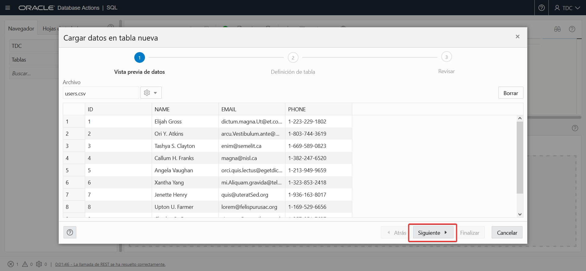
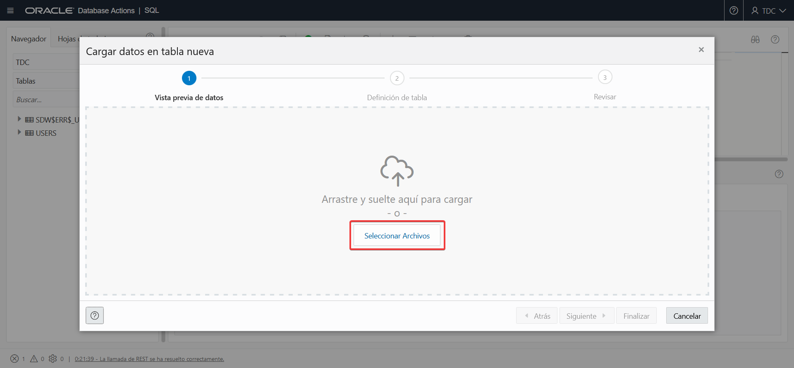
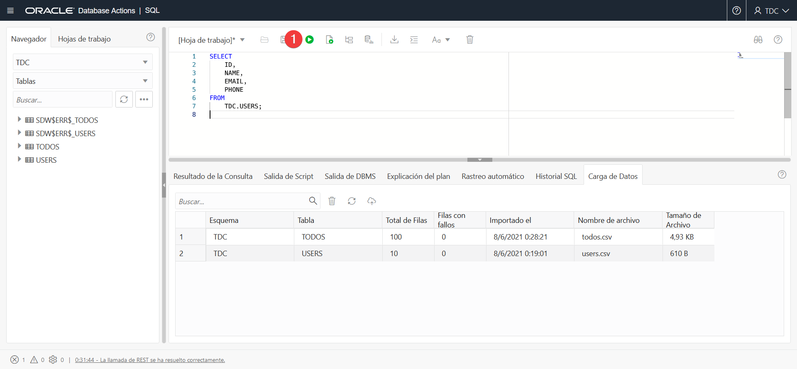
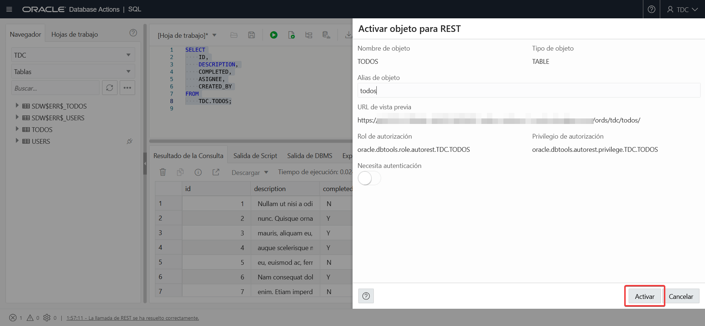
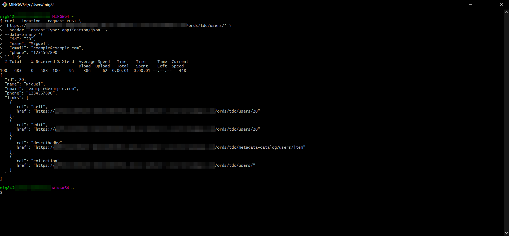

# Creando una REST API en menos de 1 hora con Oracle Database Actions

## Pre-requisitos

- Una instancia de ADB-S (Puede ser tipo "Always Free")
- Un navegador de internet
- Una terminal tipo UNIX (Puede ser "Git Bash" en Windows)
- cURL debe estar instalado en la terminal tipo UNIX que se pretenda utilizar
- Opcionalmente tener instalado `jq`, que es una herramienta de línea de comandos para formatear y filtrar JSON

## Propósito

Este documento te guiará paso a paso por la creación de una REST API para una aplicacón ficticia de recordatorios (TODOs en inglés) que tiene dos tablas:

- `USERS`: Donde almacenaremos nuestros usuarios
- `TODOS`: Donde almacenaremos nuestras tareas

En este documento proporcionaremos dos archivos con datos de ejemplo para generar las tablas que necesitamos y posteriormente procederemos a habilitar las tablas para REST usando Oracle Database Actions.

## Crear un nuevo usuario (Paso a Paso)

1. Accede a la consola de servicio de tu instancia de Autonomous Database
2. Selecciona la tab **Tools** y posteriormente haz click en **Open Database Actions**
    
3. Ingresa `ADMIN` y haz click en **Siguiente**
    
4. Ingresa tu password y haz click en **Conectar**
    
5. Abre **Usuarios de Base de Dato**
    
6. Haz click en **Crear usuario**
    
7. Llena los detalles del usuario y haz click en **Crear Usuario**. Es muy importante habilitar la opción de **Activación REST** y asignarle una cuota diferente a la predeterminada al usuario, de lo contrario no podremos cargar datos al esquema
    
8. El nuevo usuario aparecera en el reporte una vez creado correctamente
    
9. Haz click en el botón de usuario de la esquina superior derecha y después haz click en **Cerrar sesión**
    

## Carga de Datos (Paso a paso)

1. Descarga el archivo [users.csv](./assets/users.csv) del repositorio
2. Descarga el archivo [todos.csv](./assets/todos.csv) del repositorio
3. Haz click en **Conectar**
    
4. Ingresa el nuevo nombre de usuario que creaste anteriormente y haz click en **Siguiente**
    
5. Ingresa el password y haz click en **Conectar**
    
6. Haz click en **SQL**
    
7. En el panel inferior, haz click en **Carga de datos**
    
8. Haz click en el botón con el ícono de nube
    
9. Haz click en **Seleccionar Archivos**
    
10. Selecciona el archivo **users.csv** y haz click en **Abrir**
    
11. Se desplegará una previsualización de los datos, haz click en **Siguiente**
    
12. Cambia el `ID` a tipo `NUMBER`, selecciona la opción `PK` y deselecciona la opción `NULL`, luego haz click en **Siguiente** 
    
13. Se mostrará una vista previa de los comandos a ejecutarse. Haz click en **Finalizar**
    
14. Aparecerá un diálogo indicándonos que la carga de datos continuará ejecutándose en el fondo. Haz click en **Aceptar**
    
15. En el panel de abajo, debe aparecernos nuestra carga reciente en el reporte, indicando que no hubo fallos
    
16. Haz click nuevamente en el botón con el ícono de nube
    
17. Haz click en **Seleccionar Archivos**
    
18. Selecciona el archivo **todos.csv** y haz click en **Abrir**
    
19. Se mostrará una vista previa de los datos, haz click en **Siguiente**
    
20. Cambia los setings como se indica debajo y luego haz click en **Siguiente**
    - Para `ID`, cambia el tipo de datos a `NUMBER`, selecciona la opción `PK` y deselecciona la opcion `NULL`
    - Para `ASIGNEE` cambia el tipo de datos a `NUMBER` y deselecciona la opcion `NULL`
    - Para `CREATED_BY` cambia el tipo de datos a `NUMBER` y deselecciona la opcion `NULL`
    
21. Se mostrará una previsualización del código a ejecutar, haz click en **Siguiente**
    
22. Se mostrará un diálogo indicando que la subida de datos continuará en el background. Haz click en **Aceptar**
    
23. Verifica que en el reporte del panel inferior se muestre la nueva carga de datos con cero errores
    

## Verificación de los datos (Paso a paso)

1. Arrastra la tabla **USERS** desde el panel izquierdo hacia el editor, aparecerá un diálogo. Selecciona la opción **Seleccionar** y luego haz click en **Aplicar**
    
2. Se creará una consulta y se pondrá en el editor, haz click en botón con el icono de reproducción para ejecutar la consulta
    
3. Se mostrarán los resultados en el panel inferior
    
4. Haz click en el botón con el icono de basurero para borrar el contanido del editor
    
5. Arrastra la tabla **TODOS** desde el panel izquierdo hacia el editor, aparecerá un diálogo. Selecciona la opción **Seleccionar** y luego haz click en **Aplicar**
    
6. Se creará una consulta y se pondrá en el editor, haz click en botón con el icono de reproducción para ejecutar la consulta
    
7. Se mostrarán los resultados en el panel inferior
    

## Creación de los "endpoints" REST (Paso a paso)

1. Haz click derecho en la tabla de **USERS**, lusgo selecciona la opción **REST** y luego la opción **Activar**
    
2. Se mostrará un panel para activar la tabla como "endpoint" REST, haz click en **Activar**. 

    Esto creará un "endpoint" REST con soporte para los métodos `GET`, `POST`, `PUT` y `DELETE` de forma automática, los cuales probaremos más adelante.
    
    Nota que la opción **Necesita Autentificación** está desactivada para simplificar este ejemplo, pero dependiendo de tus necesidades necesitarás activarla. Los siguientes pasos asumen que esta opción está desactivada
    
3. Una vez activada la tabla como "endpoint" REST se mostrará un icono de clavija en la tabla, indicando que la tabla esta activada.
    
4. Haz click derecho en la tabla **TODOS** en el panel izquierdo, selecciona la opción **REST** y posteriormente selecciona la opción **Activar**
    
5. Se mostrará un panel, haz click en **Activar**.
    
6. Una vez activada la tabla como "endpoint" REST se mostrará un icono de clavija en la tabla, indicando que la tabla esta activada.
    

## Probando los "endpoints" REST con cURL

1. Haz click derecho en la tabla **USERS** del panel izquierdo, selecciona la opcion **REST** y posteriormente la opción **Comando cURL...**
    
2. Se abrirá un panel del lado derecho que nos mostrará distintas tabs en vertical con las acciones que podemos realizar. Por defecto, la tab **GET All** esta seleccionada. Haz click en el botón con el icono de copiar
    
3. Abre una terminal, en Windows puedes usar **Git Bash**, luego pega el comando que copiaste en la terminal, si tienes `jq` instalado, puedes añadir 
    ```sh
    | jq
    ```
    para formatear el JSON que recibamos del endpoint, de otro modo el JSON aparecerá sin espacios u otro separador.

    Observa que el JSON contiene hasta 25 filas de la tabla y además contiene los links en la parte de abajo para paginar el recurso
    
4. Regresa a Database Actions, selecciona la tab **GET Simple** y rellena el campo de **id** con `1`, luego haz click en el botón con el icono de copiar
    
5. En la terminal, pega el comando que copiaste, si tienes `jq` instalado, puedes añadir 
    ```sh
    | jq
    ```
    para formatear el JSON que recibamos del endpoint, de otro modo el JSON aparecerá sin espacios u otro separador.

    Observa que el JSON contiene una sola fila, y que el final de la URL termina con un valor de la columna `ID` de la tabla, esto debido a que en la tabla, indicamos que nuestro `PK` (Primary Key) era esa misma columna
    
6. Regresa a Database Actions, selecciona la tab **POST**, rellena el campo de **id** con `20` (Ya que no existe en nuestro data set), después rellena los demás campos y haz click en el botón con el icono de copiar
    
7. En la terminal, pega el comando que copiaste, si tienes `jq` instalado, puedes añadir 
    ```sh
    | jq
    ```
    para formatear el JSON que recibamos del endpoint, de otro modo el JSON aparecerá sin espacios u otro separador.

    Observa que el método POST insertará una fila y que el JSON devuelto contiene la fila recién creada
    
8. Regresa a Database Actions, selecciona la tab **PUT** y cambia el campo de **email** con un valor distinto al actual, luego haz click en el botón con el icono de copiar
    
9. En la terminal, pega el comando que copiaste, si tienes `jq` instalado, puedes añadir 
    ```sh
    | jq
    ```
    para formatear el JSON que recibamos del endpoint, de otro modo el JSON aparecerá sin espacios u otro separador.

    Observa que el método PUT actualizará una fila y que el JSON devuelto contiene la fila recién actualizada
    
10. Regresa a Database Actions, selecciona la tab **DELETE** y asegurate que el campo de **id** contenga el valor `20`, luego haz click en el botón con el icono de copiar
    
11. En la terminal, pega el comando que copiaste, si tienes `jq` instalado, puedes añadir 
    ```sh
    | jq
    ```
    para formatear el JSON que recibamos del endpoint, de otro modo el JSON aparecerá sin espacios u otro separador.

    Observa que el método DELETE eliminará una fila y que el JSON devuelto contiene el número de filas eliminadas
    
12. Regresa a Database Actions. Haz click en el boton **Cerrar** del panel que aparece a la izquierda y luego haz click derecho en la tabla **TODOS** del panel izquierdo, selecciona la opcion **REST** y posteriormente la opción **Comando cURL...**
    
13. El panel de cURL se abrirá en la tab **GET All**, haz click en el botón con el icono de copiar
    
14. En la terminal, pega el comando que copiaste, si tienes `jq` instalado, puedes añadir 
    ```sh
    | jq
    ```
    para formatear el JSON que recibamos del endpoint, de otro modo el JSON aparecerá sin espacios u otro separador.

    Observa que el JSON contiene hasta 25 filas de la tabla y además contiene los links en la parte de abajo para paginar el recurso
    
15. Regresa a Database Actions, selecciona la tab **GET Simple** y rellena el campo de **id** con `1`, luego haz click en el botón con el icono de copiar
    
16. En la terminal, pega el comando que copiaste, si tienes `jq` instalado, puedes añadir 
    ```sh
    | jq
    ```
    para formatear el JSON que recibamos del endpoint, de otro modo el JSON aparecerá sin espacios u otro separador.

    Observa que el JSON contiene una sola fila, y que el final de la URL termina con un valor de la columna `ID` de la tabla, esto debido a que en la tabla, indicamos que nuestro `PK` (Primary Key) era esa misma columna
    
17. Regresa a Database Actions, selecciona la tab **POST**, rellena el campo de **id** con `110` (Ya que no existe en nuestro data set), el campo **asignee** con `1` y el campo **created_by** con `1`, después rellena los demás campos y haz click en el botón con el icono de copiar
    
18. En la terminal, pega el comando que copiaste, si tienes `jq` instalado, puedes añadir 
    ```sh
    | jq
    ```
    para formatear el JSON que recibamos del endpoint, de otro modo el JSON aparecerá sin espacios u otro separador.

    Observa que el método POST insertará una fila y que el JSON devuelto contiene la fila recién creada
    
19.  Regresa a Database Actions, selecciona la tab **PUT** y cambia el campo de **completed** con un valor distinto al actual, luego haz click en el botón con el icono de copiar
    
20. En la terminal, pega el comando que copiaste, si tienes `jq` instalado, puedes añadir 
    ```sh
    | jq
    ```
    para formatear el JSON que recibamos del endpoint, de otro modo el JSON aparecerá sin espacios u otro separador.

    Observa que el método PUT actualizará una fila y que el JSON devuelto contiene la fila recién actualizada
    
21. Regresa a Database Actions, selecciona la tab **DELETE** y asegurate que el campo de **id** contenga el valor `110`, luego haz click en el botón con el icono de copiar
    
22. En la terminal, pega el comando que copiaste, si tienes `jq` instalado, puedes añadir 
    ```sh
    | jq
    ```
    para formatear el JSON que recibamos del endpoint, de otro modo el JSON aparecerá sin espacios u otro separador.

    Observa que el método DELETE eliminará una fila y que el JSON devuelto contiene el número de filas eliminadas
    

## Conclusión

Al terminar las secciones de paso a paso anteriores, habremos aprendido:

- Cómo cargar datos mediante Database Actions
- Cómo mostrar el reporte de datos de una tabla usando Database Actions
- Cómo habilitar tablas como "endpoints" REST para su acceso mediante cURL